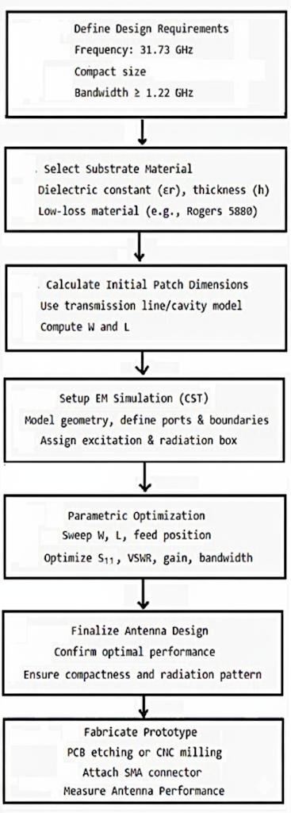
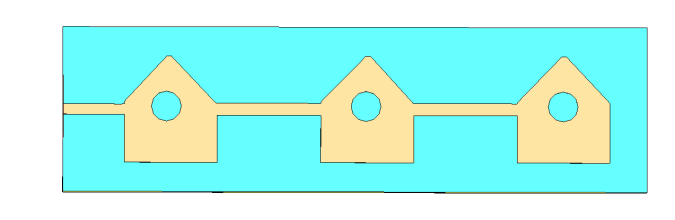
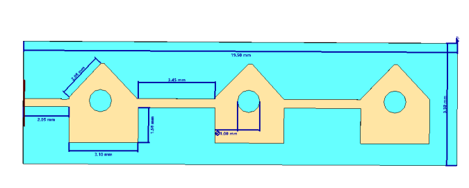
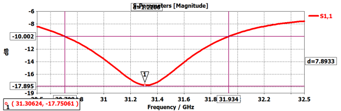
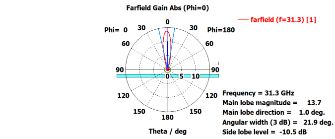
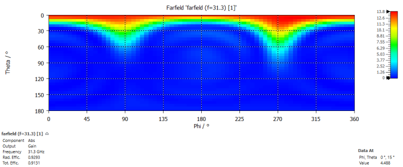
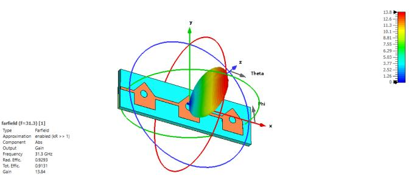
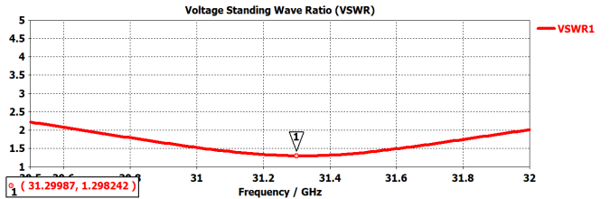

# Miniaturized 31.3 GHz Microstrip Patch Antenna for CubeSat Communications

> **IEEE Publication** | Amrita School of Engineering, Amrita Vishwa Vidyapeetham, Chennai, India  
> **Authors:** Dr. P. Jothilakshmi · Chris Calvin P · Manoj G

---

## Abstract

This paper presents a miniaturized microstrip patch antenna optimized for CubeSat communications at **31.3 GHz**. The design achieves excellent impedance matching with **S11 = −17.75 dB** (VSWR ≈ 1.3) and delivers a directive far-field pattern with a **peak gain of 13.7 dBi**, main lobe steered to 1° elevation, and a 21.9° 3 dB beamwidth — balancing coverage and selectivity for efficient satellite links.

Fabricated on a compact **19.50 mm × 3.10 mm** footprint with **92% total efficiency**, the antenna is designed to integrate seamlessly into the standard 10×10×10 cm CubeSat frame. Target applications include Earth observation data downlinks, inter-satellite networking, and reliable communication in power-limited orbital environments.

---

## Key Performance Metrics

| Parameter | Value |
|---|---|
| Operating Frequency | 31.3 GHz |
| Return Loss (S11) | −17.75 dB |
| VSWR | 1.298 |
| Peak Gain | 13.7 dBi |
| Main Lobe Direction | 1.0° |
| 3 dB Beamwidth | 21.9° |
| Side Lobe Level | −10.5 dB |
| Total Radiation Efficiency | 91.31% |
| Footprint | 19.50 mm × 3.10 mm |
| Substrate | Rogers 5880 (εr = 2.2, h = 0.254 mm) |

---

## Design Methodology

### Step 1 — Substrate Selection
A low-loss high-frequency laminate with dielectric constant **εr = 2.2** and thickness **h = 0.254 mm** was selected for its excellent dimensional stability, low dissipation factor, and stable dielectric properties across wide frequency and temperature ranges — critical for millimeter-wave operation.

### Step 2 — Initial Patch Dimension Calculation
Initial resonant patch dimensions were derived using standard microstrip antenna design equations, assuming the fundamental **TM10 mode** resonating at 31.3 GHz:

$$W = \frac{c}{2f_r\sqrt{\frac{\varepsilon_r + 1}{2}}}$$

This gives an initial width W ≈ 4.61 mm. Final optimized dimensions (19.50 mm × 3.10 mm) were refined through full-wave EM simulation to account for fringing fields and exact resonance.

### Step 3 — Slot Array Integration
A complex multi-slot array was integrated into the radiating patch — three triangular sections each with a circular aperture of **1.00 mm** diameter and a central aperture of **1.48 mm**. These slots perturb surface current distribution to excite multiple resonant modes, broadening the −10 dB impedance bandwidth while maintaining directional performance.

### Step 4 — Feed Network Design
A direct-contact microstrip feed line was implemented with:
- Feed line width: **0.50 mm** (matched to 50 Ω characteristic impedance)
- Inset depth: **1.48 mm**
- Inset width: **1.00 mm**

Parameters were swept and optimized to minimize return loss and achieve impedance match at 31.3 GHz.

### Step 5 — Full-Wave EM Simulation (CST Microwave Studio)
The complete design was simulated using adaptive mesh refinement with open (absorbing) boundary conditions to replicate anechoic conditions. A waveguide port was used for excitation. Convergent results were obtained for S-parameters, radiation patterns, gain, and total efficiency.

---

## Design Flow



*Fig. 1 — End-to-end design flow: from requirements definition through substrate selection, patch dimension calculation, EM simulation, parametric optimization, and prototype fabrication.*

The flow begins with defining requirements (31.73 GHz target, compact size, bandwidth ≥ 1.22 GHz), followed by substrate selection, calculation of initial patch dimensions using transmission line/cavity models, CST setup with boundary conditions and port assignment, parametric sweeps over W, L, and feed position optimizing S11/VSWR/gain/bandwidth, and finally fabrication via PCB etching or CNC milling with SMA connector attachment.

---

## Antenna Structure

### Simulated Structure in CST Microwave Studio



*Fig. 2 — Simulated patch antenna structure in CST Microwave Studio, showing the multi-slotted radiating element on the low-loss laminate substrate.*

### Antenna Dimensions



*Fig. 3 — Detailed microstrip antenna structure with dimensions. Overall length 19.50 mm, width 3.10 mm, individual section heights 2.05 mm and 2.06 mm. Three triangular sections connected by a central strip, each with 1.00 mm circular apertures and a 1.48 mm central aperture.*

### Ground Plane, Substrate, and Patch Layers


*Fig. 4 — Cross-sectional view of the antenna showing the ground plane, substrate (h = 0.254 mm, εr = 2.2), and patch layer stack. The thin substrate is critical for maintaining low dielectric loss at millimeter-wave frequencies.*

---

## Simulation Results

### Return Loss (S11)



*Fig. 5 — Simulated S11 (reflection coefficient magnitude in dB) vs. frequency. A sharp resonant dip is observed at **31.30 GHz** with S11 = **−17.75 dB**, confirming excellent impedance match. The antenna operates within the −10 dB impedance bandwidth across the full target operational band — well-suited for high-data-rate CubeSat communication.*

The VSWR corresponding to this resonance is computed as:

$$\text{VSWR} = \frac{1 + |S_{11}|_{\text{linear}}}{1 - |S_{11}|_{\text{linear}}}$$

Yielding **VSWR ≈ 1.3**, indicating minimal reflected power and near-maximum energy delivery to the radiating element.

---

### Far-Field Gain Pattern (Polar Plot)



*Fig. 6 — 2D polar plot of far-field gain at 31.3 GHz (azimuth cut at Phi = 0°). Key characteristics:*
- *Peak gain: **13.7 dBi***
- *Main lobe direction: **1.0°** from broadside*
- *3 dB angular width: **21.9°***
- *Side lobe level: **−10.5 dB***

The narrow beamwidth and low side lobe level confirm the antenna's strong directional performance — essential for point-to-point CubeSat communication links where targeted energy delivery is critical.

---

### Far-Field 2D Color Map



*Fig. 7 — 2D color map of far-field radiation pattern at 31.3 GHz, plotting gain (dBi) across Theta (elevation) and Phi (azimuth) angles. The color scale ranges from blue (minimum gain) to red (maximum gain). The dominant red band concentrated at small Theta angles confirms near-broadside radiation, validating the antenna's directional characteristics and spatial coverage suitable for CubeSat uplink/downlink operations.*

---

### 3D Far-Field Radiation Pattern



*Fig. 8 — Three-dimensional representation of the far-field radiation pattern at 31.3 GHz. The color-coded single dominant lobe (red = high gain) is directed in an off-broadside direction as indicated by the propagation arrow. Total efficiency: **91.31%**, peak gain: **13.7 dBi**. The 3D pattern confirms the antenna's suitability for focused directional communication — critical for narrow-beam CubeSat applications such as Earth observation data downlinks.*

---

### VSWR vs. Frequency



*Fig. 9 — Computed VSWR vs. frequency. Minimum VSWR of **1.298** at **31.30 GHz**, confirming the high-quality impedance match. VSWR remains below 2 across the full operational bandwidth, ensuring effective power transfer throughout the target frequency range. This validates that the feed network design and optimization are functioning correctly for millimeter-wave CubeSat applications.*

---

## Conclusion

This work demonstrates a high-performance miniaturized 31.3 GHz microstrip patch antenna achieving:

- **S11 = −17.75 dB** with effective −10 dB impedance bandwidth
- **Peak gain of 13.7 dBi** with 91.31% total radiation efficiency
- **Compact 19.50 mm × 3.10 mm footprint** on low-loss Rogers substrate
- Main lobe direction of 1.0° with 21.9° 3 dB beamwidth

The multi-slotted radiating element design and optimized inset microstrip feed deliver both the compactness and electromagnetic performance demanded by CubeSat platforms. This antenna represents a robust and scalable solution for high-speed millimeter-wave satellite communication — Earth observation, inter-satellite networking, and future evolved space-based wireless systems.

---

## Applications

- **Earth Observation** — High-data-rate downlinks from low-earth orbit CubeSats
- **Inter-Satellite Networking** — Narrow-beam point-to-point links between CubeSat constellations
- **Power-Limited Orbital Platforms** — High efficiency minimizes DC power budget impact
- **Ka-Band SATCOM** — Scalable design applicable to broader Ka-band satellite communication systems

---

## Citation

If you use this work, please cite:

```
P. Jothilakshmi, Chris Calvin P, and Manoj G, "Design and Optimization of a Miniaturized 
31.3 GHz Microstrip Patch Antenna for CubeSat Communications," IEEE, 2024.
```

---

## Authors

| Author | Affiliation | Contact |
|---|---|---|
| Dr. P. Jothilakshmi | ECE, Amrita School of Engineering | p_jothilakshmi@ch.amrita.edu |
| Chris Calvin P | ECE, Amrita School of Engineering | ch.en.u4ece23011@ch.students.amrita.edu |
| Manoj G | ECE, Amrita School of Engineering | ch.en.u4ece23031@ch.students.amrita.edu |
